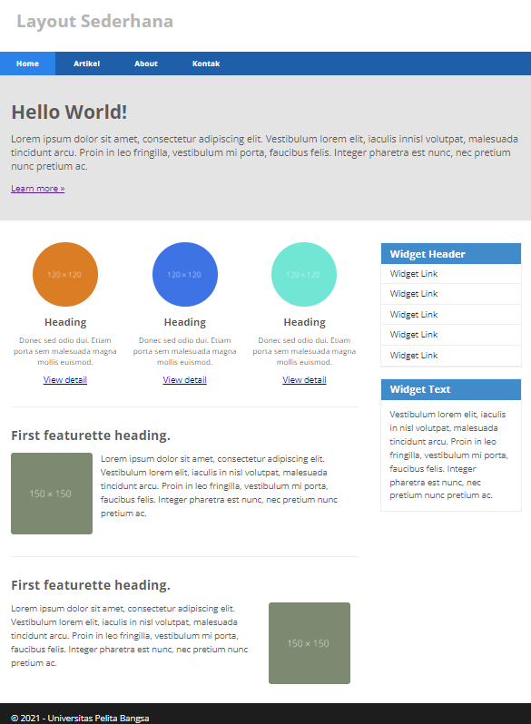
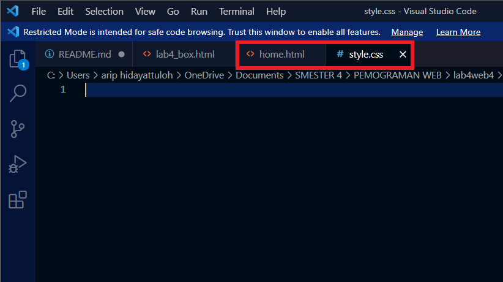

# Lab4Web

## Nama : Arip Hidayattuloh
## Nim  : 312010244
## Kelas : TI.20.B.1
Instruksi Praktikum
1. Persiapkan text editor misalnya VSCode.
2. Buat folder baru dengan nama Lab4Web
3. Ikuti langkah-langkah praktikum yang akan dijelaskan berikutnya.
4. Lakukan validasi dokumen html dengan mengakses http://validator.w3.org
Langkah-langkah Praktikum
Persiapan membuat dokumen HTML dengan nama file lab4_box.html seperti berikut.

 

## Membuat Box Element
 Kemudian tambahkan kode untuk membuat box element dengan tag div seperti berikut.

 

## CSS Float Property
 Selanjutnya tambahkan deklarasi CSS pada head untuk membuat float element, seperti berikut.

 

## Mengatur Clearfix Element Clearfix 
 digunakan untuk mengatur element setelah float element. Property clear digunakan untuk
mengaturnya.
Tambahkan element div lainnya seteleah div3 seperti berikut.
Kemudian atur property clear pada CSS, seperti berikut.

 

## Membuat Layout Sederhana
 Kita akan membuat layout web sederhana seperti gambar berikut.

Buat folder baru dengan nama lab4_layout,

kemudian buatlah file baru didalamnya dengan nama
home.html, dan file css dengan nama style.css.

dan di visual codenya seperti ini

Kemudian buat kerangka layout dengan semantics element seperti berikut.

Kemudian tulis kode berikut.

## Kemudian tambahkan kode CSS untuk membuat layoutnya.

## Membuat Navigasi

Kemudian selanjutnya mengatur navigasi

## Membuat Hero Panel.

Selanjutnya membuat hero panel. Tambahkan kode HTML dan CSS seperti berikut

## Mengatur Layout Main dan Sidebar

Selanjutnya mengatur main content dan sidebar, tambahkan CSS float

Membuat Sidebar Widget
Kemudian selanjutnya menambahkan element lain dalam sidebar

Kemudian tambahkan CSS

## Mengatur Footer

Selanjutnya mengatur tampilan footer. Tambahkan CSS untuk footer

## Menambahkan Elemen lainnya pada Main Content

Kemudian tambahkan CSS.

Lihat hasilnya dibrowser

## Menambahkan Content Artikel

Selanjutnya membuat content artikel. Tambahkan HTML berikut pada main content.

Kemudian tambahkan CSS

## Pertanyaan dan Tugas

1. Tambahkan Layout untuk menu About
=> buat single layout yang berisi deskripsi, portfolio, dll

2. Tambahkan layout untuk menu Contact
=> yang berisi form isian: nama, email, message, dll

sekian dari saya 

Arip Hidayattuloh